# Nestique - Architecture & Flow Diagrams

> **Auto-generated diagrams for your Nestique project**
> Based on analysis of: https://github.com/rahulgoyal83789/Nestique

---

## 📋 Table of Contents
1. [System Architecture](#system-architecture)
2. [User Authentication Flow](#user-authentication-flow)
3. [Listing CRUD Operations](#listing-crud-operations)
4. [Image Upload Flow](#image-upload-flow)
5. [Review System Flow](#review-system-flow)
6. [Complete Request Lifecycle](#complete-request-lifecycle)
7. [Database Schema](#database-schema)
8. [Folder Structure](#folder-structure)

---

## 🏗️ System Architecture

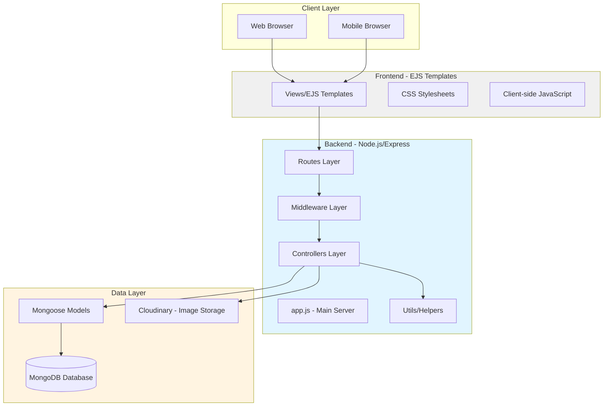

---

## 🔐 User Authentication Flow

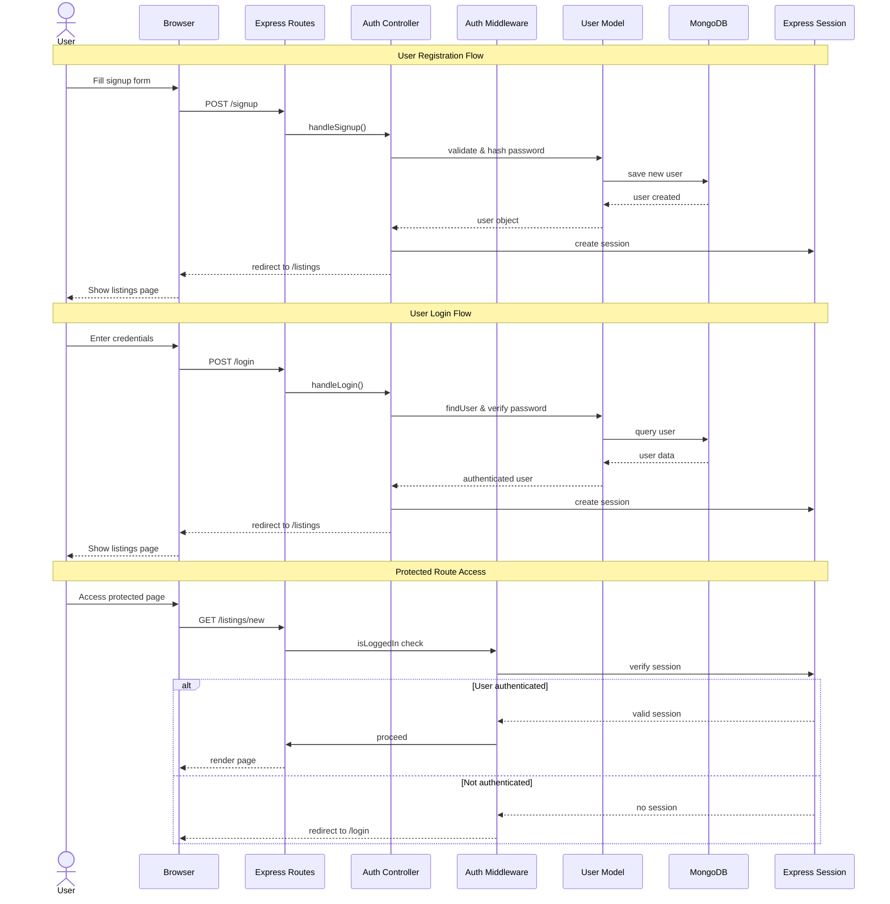

---

## 🏠 Listing CRUD Operations

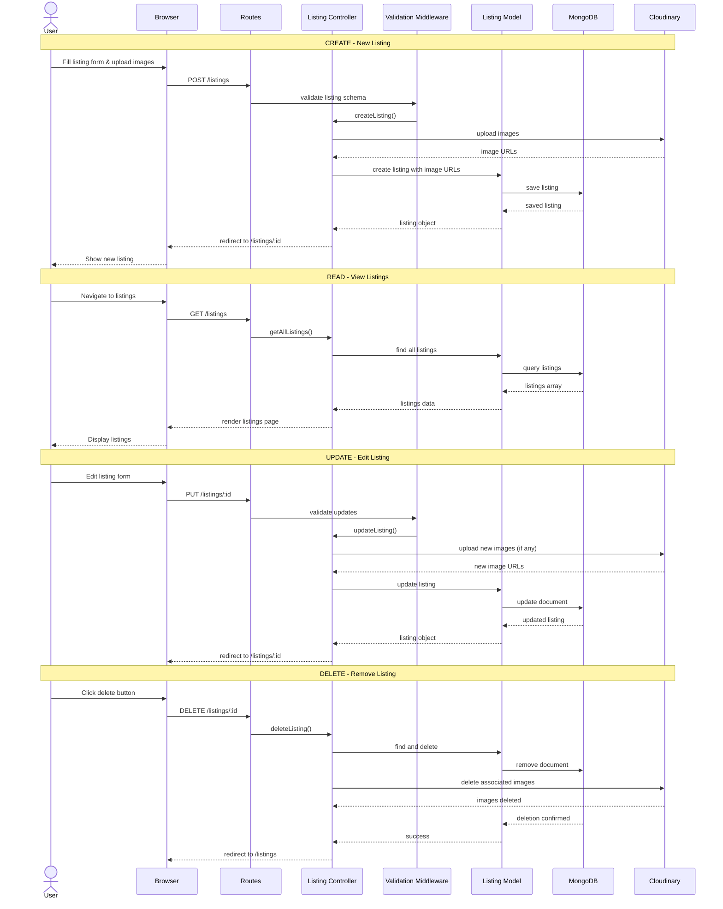

---

## 📸 Image Upload Flow (Cloudinary Integration)

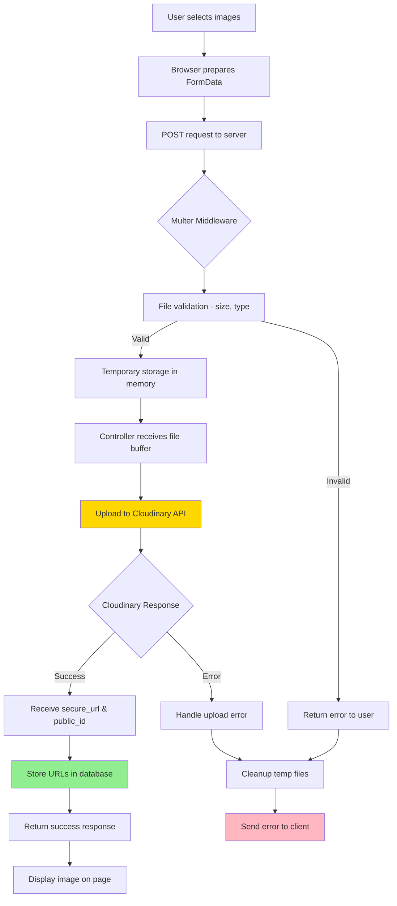

**Detailed Cloudinary Flow:**

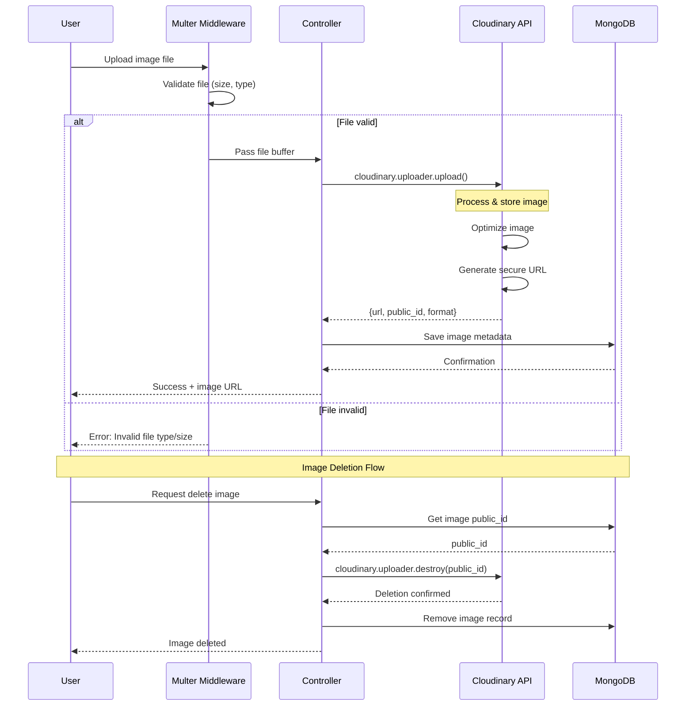

---

## ⭐ Review System Flow

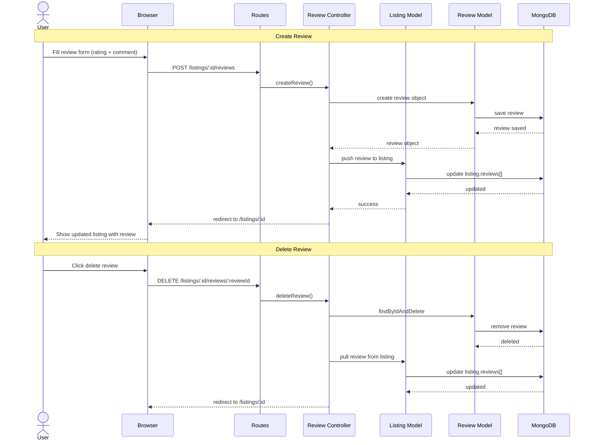

---

## 🔄 Complete Request Lifecycle

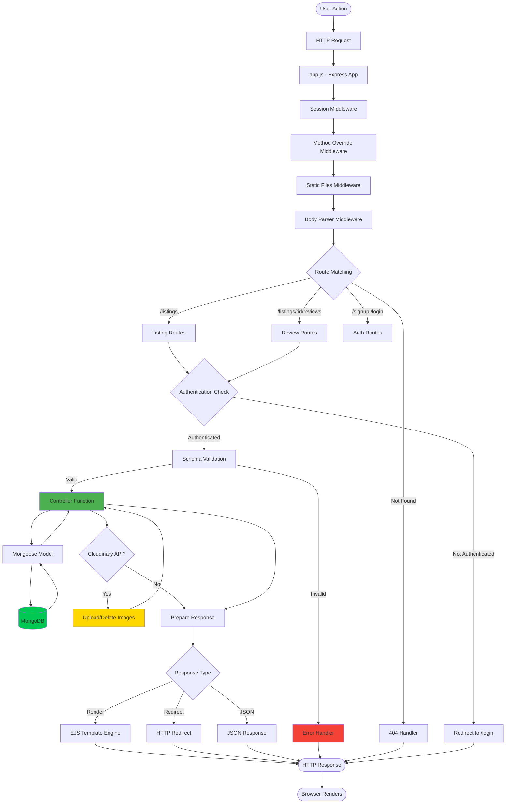

---

## 🗄️ Database Schema (Mongoose Models)

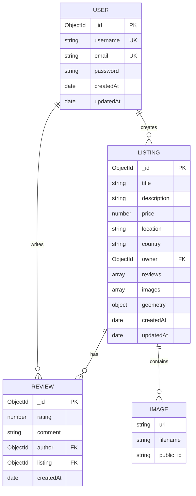

---

## 📁 Folder Structure Diagram

```mermaid
graph TB
    Root[Nestique/] --> App[app.js]
    Root --> Package[package.json]
    Root --> Cloud[cloudConfig.js]
    Root --> MW[middleware.js]
    Root --> Schema[schema.js]
    
    Root --> Controllers[controllers/]
    Controllers --> ListingCtrl[listing.js]
    Controllers --> ReviewCtrl[review.js]
    Controllers --> UserCtrl[user.js]
    
    Root --> Models[models/]
    Models --> ListingModel[listing.js]
    Models --> ReviewModel[review.js]
    Models --> UserModel[user.js]
    
    Root --> Routes[routes/]
    Routes --> ListingRoutes[listing.js]
    Routes --> ReviewRoutes[review.js]
    Routes --> UserRoutes[user.js]
    
    Root --> Views[views/]
    Views --> Layouts[layouts/]
    Views --> Listings[listings/]
    Views --> Users[users/]
    Views --> Includes[includes/]
    
    Root --> Public[public/]
    Public --> CSS[css/]
    Public --> JS[js/]
    Public --> Images[images/]
    
    Root --> Utils[utils/]
    Utils --> ExpressErr[ExpressError.js]
    Utils --> WrapAsync[wrapAsync.js]
    
    Root --> Init[init/]
    Init --> Data[data.js]
    Init --> Index[index.js]
    
    style App fill:#4CAF50
    style Controllers fill:#2196F3
    style Models fill:#FF9800
    style Routes fill:#9C27B0
    style Views fill:#00BCD4
```

---

## 🔗 API Endpoints & Route Mapping

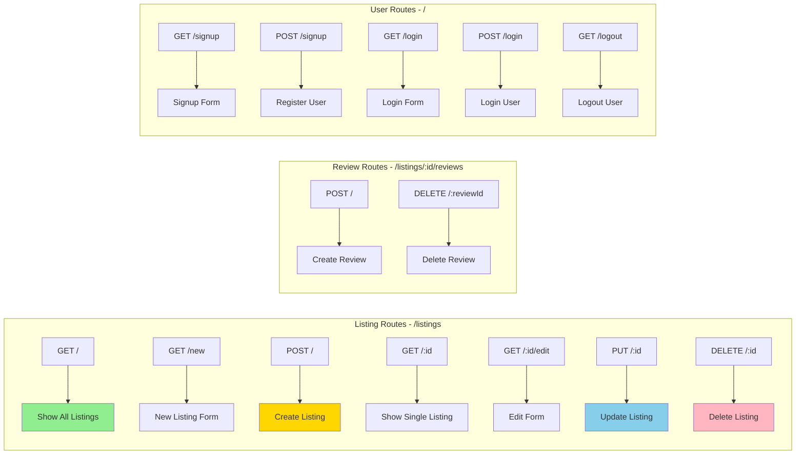

---

## 🛡️ Middleware Flow

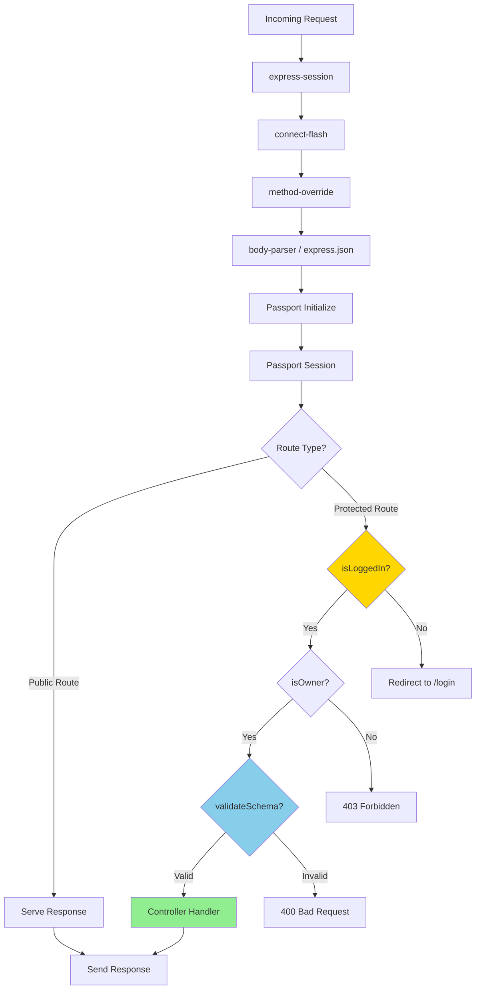

---

## 📊 Data Validation Flow (Joi Schema)

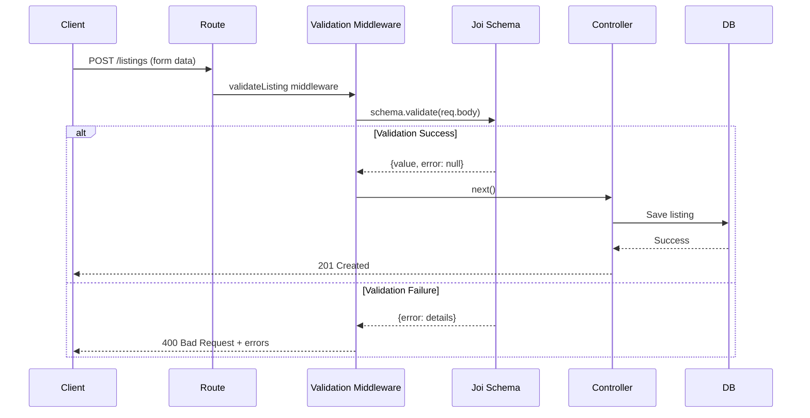

---

## 🎯 How to Use These Diagrams

### **Step 1: Copy to Your Repository**
```bash
# Create docs folder in your project
mkdir -p docs

# Copy this file to your docs folder
cp NESTIQUE-DIAGRAMS.md /path/to/Nestique/docs/
```

### **Step 2: View on GitHub**
- Just push to GitHub - diagrams render automatically in markdown files!
- Visit: `https://github.com/rahulgoyal83789/Nestique/blob/main/docs/NESTIQUE-DIAGRAMS.md`

### **Step 3: Preview Locally in VS Code**
1. Install extension: "Markdown Preview Mermaid Support"
2. Open this file in VS Code
3. Press `Ctrl+Shift+V` (or `Cmd+Shift+V` on Mac)

### **Step 4: Edit Diagrams Online**
- Visit: https://mermaid.live
- Copy any diagram code from above
- Edit and export as SVG/PNG if needed

---

## 📝 Customization Tips

**To update any diagram:**
1. Find the relevant section above
2. Edit the mermaid code block
3. Commit and push - GitHub renders it automatically!

**Common changes you might want:**
- Add new routes → Update "API Endpoints" section
- Add new middleware → Update "Middleware Flow" section
- Add new database models → Update "Database Schema" section

---

## 🚀 Next Steps

1. **Review the diagrams** - Are they accurate for your project?
2. **Add more details** - Add specific endpoint paths, error codes, etc.
3. **Keep updated** - Update diagrams when you add new features
4. **Share with team** - These are great for onboarding new developers!

---

**Generated for:** Nestique by Rahul Goyal  
**Date:** May 2, 2026  
**Repository:** https://github.com/rahulgoyal83789/Nestique
